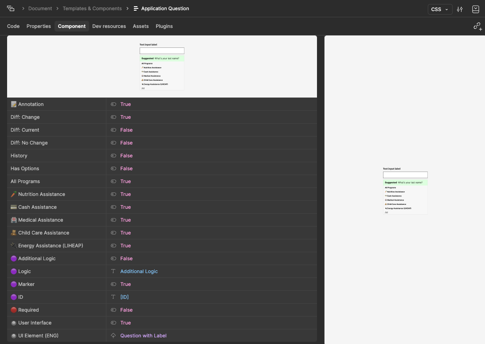
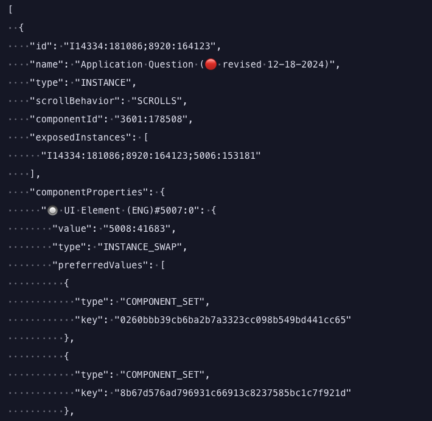
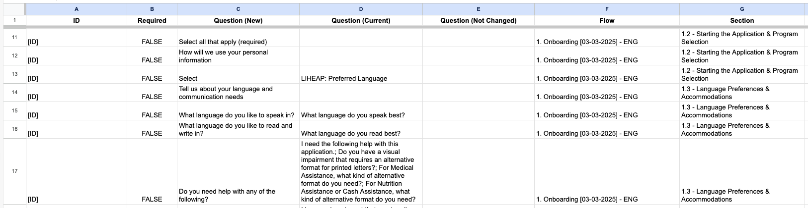

# Figma Application Question Export

Exports component properties, or meta data, from Figma files that use the **Application Question** component to design integrated benefit applications. This won't work with every Figma form flow project but it can be adapted to extract component data for other projects.

Below is an image of the component property data it can access for each "Application Question"

Below is a preview image of the JSON output of the "Application Question" component property data.

Below is an image of the CSV data it currently compiles for multiple "Application Questions".

## Instructions

1. Rename the `config.js` file to `.config.js` and add the following information
    * Your personal Figma access token.
    * The file key ID to pull from.
    * The node IDs of pages in the file to pull from.
    * The component to extract from the file.

1. Run the command `node meta.js` to request data and build the export.
